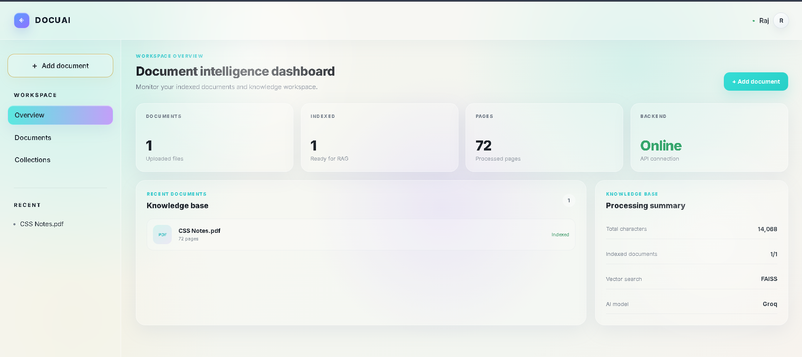
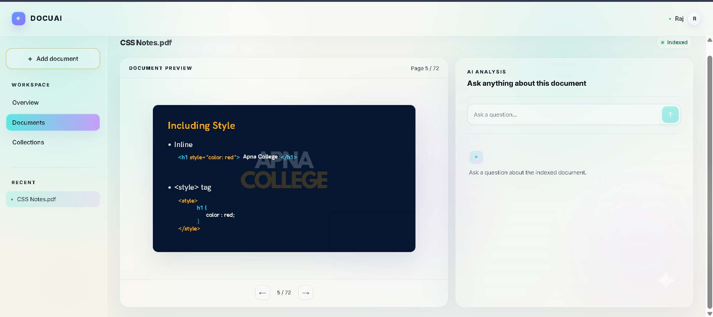
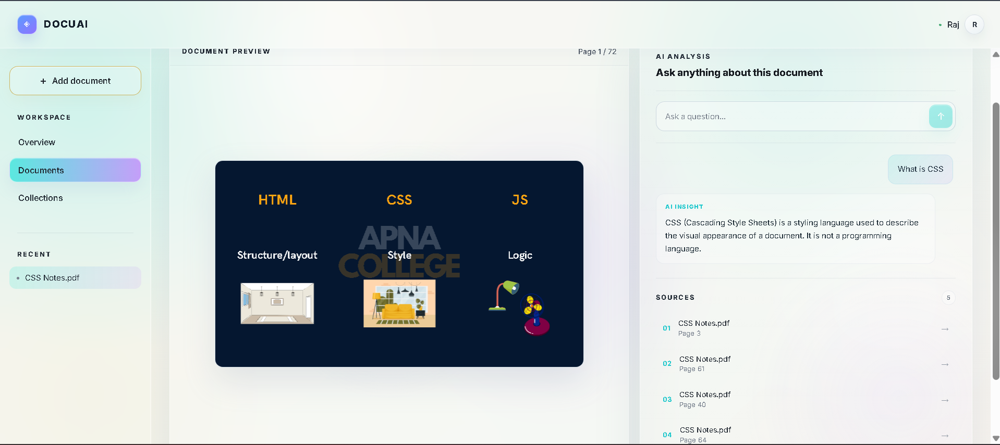
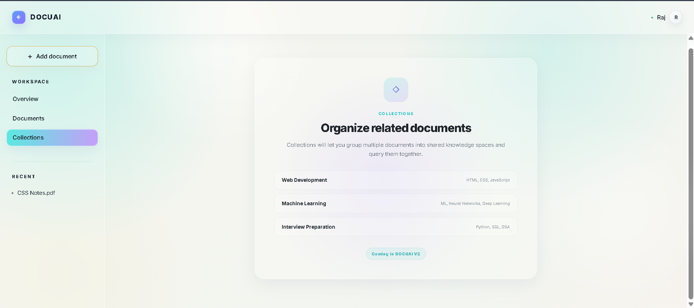

<div align="center">

# 📄🤖 DOCUAI — AI Document Intelligence

**Chat with your PDFs. Get grounded answers. Jump straight to the proof.**


</div>

---

## ✨ What is DOCUAI?

**DOCUAI** is a full-stack **Retrieval-Augmented Generation (RAG)** application for working with PDF documents.

> 📤 Upload → 🧩 Index → 💬 Ask → 🎯 Get a grounded answer → 🔍 See the exact source page

Users can:
- 📁 Upload PDFs
- 🧠 Index their contents with vector embeddings
- ❓ Ask natural-language questions about a selected document
- ✅ Receive answers **grounded in the document content**
- 🔗 View the retrieved sources
- 📖 Jump directly to the **exact PDF page** used to support an answer

**Stack at a glance:** ⚛️ React frontend • ⚡ FastAPI backend • 📄 PyMuPDF processing • 🧬 Sentence Transformers embeddings • 🗂️ FAISS vector search • 🔗 LangChain orchestration • 🚀 Groq for answer generation

---

## 🚦 Project Status

<div align="center">

### ✅ MVP Complete

</div>

The core workflow has been implemented and tested successfully:

```text
📤 Upload PDF
    ↓
📝 Extract text
    ↓
✂️ Chunk document
    ↓
🧬 Generate embeddings
    ↓
🗂️ Index with FAISS
    ↓
📂 Select document
    ↓
❓ Ask a question
    ↓
🔎 Retrieve relevant chunks
    ↓
🤖 Generate grounded answer with Groq
    ↓
📚 Show sources
    ↓
🖱️ Click a source
    ↓
📖 Open the exact PDF page
```

---

## 🌟 Features

### 📁 Document Management

- 📤 Upload PDF documents
- 📝 Extract text page-by-page using PyMuPDF
- 💾 Persist document metadata locally
- 🔄 Load previously uploaded documents after restart
- 🔀 Select between multiple uploaded documents
- 🗑️ Delete documents
- 🧹 Remove deleted document data from the FAISS index
- 🏗️ Rebuild the vector store after document deletion

### 🧠 AI Question Answering

- ❓ Ask natural-language questions about the selected document
- 🧬 Generate semantic embeddings using Sentence Transformers
- 🔎 Retrieve relevant chunks using FAISS
- 🎯 Restrict retrieval to the currently selected document
- 🔗 Use LangChain to build the RAG workflow
- 🚀 Generate answers using Groq
- 📏 Instruct the LLM to answer from retrieved document context
- 🏷️ Return source document names and page numbers
- 📊 Display similarity scores from retrieval

### 📖 PDF Intelligence

- 👀 Preview the original PDF directly in the React application
- ↔️ Navigate between PDF pages
- 🔢 Display current page and total page count
- 🖱️ Click a retrieved source to jump directly to the referenced PDF page
- 🔗 Keep AI answers visually connected to supporting document sources

### 📊 Dashboard

DOCUAI includes an **Overview** screen with:

- 📁 Total uploaded documents
- ✅ Indexed document count
- 📄 Total processed pages
- 🟢 Backend connection status
- 🕓 Recent documents
- 🧾 Knowledge-base processing summary

### 🎨 User Experience

- ⚛️ Modern React interface
- 📱 Responsive workspace layout
- ⏳ Upload and indexing feedback
- 🔔 Toast success/error notifications
- ⚠️ Custom delete confirmation modal
- 🟡 Dynamic document indexing status
- 🫥 Empty states
- 💚 Backend health indicator
- 🔄 Document-specific chat reset
- 🗂️ Collections preview screen for future multi-document grouping

---

## 📸 Screenshots










---

## 🏗️ Architecture

```text
                         🤖 DOCUAI
                            │
                     ⚛️ React + Vite
                            │
                            │ REST API
                            ▼
                        ⚡ FastAPI
                            │
          ┌─────────────────┴─────────────────┐
          │                                   │
          ▼                                   ▼
   📄 Document Processing              🔗 RAG Pipeline
       PyMuPDF                                │
          │                                   │
          ▼                                   ▼
   📝 Text Extraction                   ❓ User Question
          │                                   │
          ▼                                   ▼
       ✂️ Chunking                     🧬 Query Embedding
          │                                   │
          ▼                                   ▼
 🧬 Sentence Transformers              🗂️ FAISS Search
          │                                   │
          ▼                                   ▼
      📦 Embeddings                    🔎 Relevant Chunks
          │                                   │
          ▼                                   ▼
       🗂️ FAISS                       🔗 LangChain Prompt
                                              │
                                              ▼
                                          🚀 Groq LLM
                                              │
                                              ▼
                                    ✅ Answer + Sources
                                              │
                                              ▼
                                        ⚛️ React UI
                                              │
                                              ▼
                                    📖 Exact PDF Page
```

---

## 🔄 RAG Workflow

### 1️⃣ PDF Upload

The React frontend sends the selected PDF to the FastAPI backend.

### 2️⃣ Text Extraction

PyMuPDF extracts text page-by-page while preserving page numbers.

### 3️⃣ Chunking

Extracted page text is divided into overlapping chunks.

Each chunk stores metadata similar to:

```json
{
  "document_id": "document-id",
  "source": "document.pdf",
  "page": 12,
  "text": "chunk text"
}
```

### 4️⃣ Embedding Generation

Chunk text is converted into vector embeddings using:

```text
sentence-transformers/all-MiniLM-L6-v2
```

Embeddings are normalized before indexing.

### 5️⃣ FAISS Indexing

DOCUAI stores normalized embeddings in a FAISS `IndexFlatIP` index.

Metadata is stored separately and mapped to the corresponding vectors.

### 6️⃣ Question Retrieval

When the user asks a question:

```text
❓ Question
   ↓
🧬 Question embedding
   ↓
🗂️ FAISS similarity search
   ↓
🎯 Filter results by selected document ID
   ↓
🏆 Top relevant chunks
```

### 7️⃣ Context Construction

The retrieved chunks are converted into context containing:

- 📄 Document name
- 🔢 Page number
- 📝 Relevant text

### 8️⃣ Answer Generation

LangChain builds the prompt and passes the retrieved context and question to Groq.

The model is instructed to answer from the supplied document context and avoid inventing information that is not supported by the document.

### 9️⃣ Source Navigation

The API returns the answer together with its sources.

When a user clicks a source in the frontend, the PDF viewer automatically navigates to the referenced page.

---

## 🛠️ Tech Stack

<div align="center">

### 🎨 Frontend


### ⚙️ Backend


### 🧠 AI / RAG


</div>

- **Frontend:** React, Vite, JavaScript, CSS, React PDF, PDF.js
- **Backend:** Python, FastAPI, Uvicorn, Pydantic
- **AI / RAG:** LangChain, Groq API, Sentence Transformers, Hugging Face model ecosystem, FAISS
- **Document Processing:** PyMuPDF
- **Persistence:** JSON document registry, local PDF file storage, persistent FAISS vector index, JSON FAISS metadata

---

## 🌳 Project Structure

```text
ai-document-intelligence/
│
├── 🔧 backend/
│   │
│   ├── app/
│   │   │
│   │   ├── __init__.py
│   │   ├── main.py
│   │   │
│   │   ├── 🛣️ routes/
│   │   │   ├── __init__.py
│   │   │   ├── health.py
│   │   │   ├── documents.py
│   │   │   └── chat.py
│   │   │
│   │   ├── ⚙️ services/
│   │   │   ├── __init__.py
│   │   │   ├── pdf_service.py
│   │   │   └── document_registry.py
│   │   │
│   │   └── 🧠 rag/
│   │       ├── __init__.py
│   │       ├── chunker.py
│   │       ├── embeddings.py
│   │       ├── vector_store.py
│   │       ├── retriever.py
│   │       ├── llm.py
│   │       └── rag_chain.py
│   │
│   ├── 📁 uploads/
│   ├── 🗂️ vector_store/
│   │   ├── documents.index
│   │   └── metadata.json
│   │
│   ├── 💾 data/
│   │   └── documents.json
│   │
│   ├── 🔐 .env
│   ├── .env.example
│   └── requirements.txt
│
├── 🎨 frontend/
│   │
│   ├── src/
│   │   ├── 🧩 components/
│   │   │   ├── Header.jsx
│   │   │   ├── Sidebar.jsx
│   │   │   ├── Overview.jsx
│   │   │   ├── Collections.jsx
│   │   │   ├── DocumentPreview.jsx
│   │   │   ├── AIAnalysis.jsx
│   │   │   ├── SourceList.jsx
│   │   │   ├── Toast.jsx
│   │   │   ├── DeleteModal.jsx
│   │   │   └── UploadProgress.jsx
│   │   │
│   │   ├── App.jsx
│   │   ├── App.css
│   │   ├── api.js
│   │   └── main.jsx
│   │
│   ├── package.json
│   └── vite.config.js
│
├── 📸 docs/
│   └── screenshots/
│
├── .gitignore
└── README.md
```

> ⚠️ The exact project tree may differ slightly depending on your local development setup.

---

## 🔌 API Endpoints

### 💚 Health Check

```http
GET /health
```

Checks whether the FastAPI backend is running.

### 📋 List Documents

```http
GET /documents
```

Returns all registered documents.

### 📤 Upload Document

```http
POST /documents/upload
```

Uploads and processes a PDF. The backend saves the file, extracts text, creates chunks, generates embeddings, stores vectors in FAISS, and registers document metadata.

### 📄 Get PDF File

```http
GET /documents/{document_id}/file
```

Returns the original uploaded PDF so it can be displayed in the React PDF viewer.

### 🗑️ Delete Document

```http
DELETE /documents/{document_id}
```

Deletes the selected document and removes its associated registry entry, uploaded PDF, metadata, and vector data. The remaining vector store is rebuilt.

### 💬 Ask a Question

```http
POST /api/chat
```

Example request:

```json
{
  "question": "What is CSS Flexbox?",
  "document_id": "document-id"
}
```

Example response:

```json
{
  "answer": "CSS Flexbox is a one-dimensional layout method...",
  "sources": [
    {
      "source": "CSS Notes.pdf",
      "page": 52,
      "score": 0.65
    }
  ]
}
```

---

## 💻 Local Setup

### ✅ Prerequisites

Install:

- 🐍 Python 3.10+ recommended
- 🟢 Node.js
- 📦 npm
- 🔧 Git

You also need a 🔑 **Groq API key**.

### 1️⃣ Clone the Repository

Replace the URL below with your actual GitHub repository URL:

```bash
git clone YOUR_GITHUB_REPOSITORY_URL
```

Then:

```bash
cd ai-document-intelligence
```

### 2️⃣ Backend Setup

Navigate to the backend:

```bash
cd backend
```

Create a virtual environment:

```bash
python -m venv venv
```

Activate on Windows PowerShell / Command Prompt:

```bash
venv\Scripts\activate
```

Activate on Git Bash:

```bash
source venv/Scripts/activate
```

Install dependencies:

```bash
pip install -r requirements.txt
```

### 3️⃣ Configure Environment Variables

Create:

```text
backend/.env
```

Add:

```env
GROQ_API_KEY=your_groq_api_key_here
```

Also create:

```text
backend/.env.example
```

with:

```env
GROQ_API_KEY=your_groq_api_key_here
```

> 🚫 Do **not** commit the real `.env` file.

### 4️⃣ Start the Backend

From the `backend` directory:

```bash
uvicorn app.main:app --reload
```

Backend:

```text
http://127.0.0.1:8000
```

FastAPI Swagger documentation:

```text
http://127.0.0.1:8000/docs
```

### 5️⃣ Frontend Setup

Open another terminal and navigate to the frontend:

```bash
cd frontend
```

Install dependencies:

```bash
npm install
```

Start Vite:

```bash
npm run dev
```

The frontend normally runs at:

```text
http://localhost:5173
```

---

## ▶️ Running DOCUAI

For local development, use two terminals.

### 🖥️ Terminal 1 — Backend

```bash
cd backend
venv\Scripts\activate
uvicorn app.main:app --reload
```

### 🖥️ Terminal 2 — Frontend

```bash
cd frontend
npm run dev
```

Then open:

```text
http://localhost:5173
```

---

## 📘 How to Use

1. ▶️ Start the backend and frontend.
2. 🌐 Open DOCUAI in the browser.
3. ➕ Click **Add document**.
4. 📄 Select a PDF.
5. ⏳ Wait while DOCUAI processes and indexes the document.
6. 🗂️ Select the document from the sidebar.
7. ⌨️ Type a question in the AI Analysis panel.
8. 📨 Submit the question.
9. 👀 Review the generated answer.
10. 🔍 Review the retrieved sources.
11. 🖱️ Click a source to jump to the exact referenced PDF page.
12. 🗑️ Use the delete control to remove a document when required.

---

## 🖼️ Current UI Sections

### 📊 Overview

Displays workspace-level information including document count, indexed document count, processed pages, backend availability, recent documents, and processing summary.

### 📁 Documents

The main document intelligence workspace containing the PDF viewer, AI question input, generated answer, retrieved sources, and source-page navigation.

### 🗂️ Collections

Collections are currently presented as a future feature. The planned functionality is to group related documents into shared knowledge spaces and query them together.

Example:

```text
📚 Machine Learning
├── 📄 Machine Learning Notes.pdf
├── 📄 Neural Networks.pdf
└── 📄 Deep Learning.pdf
```

---

## 💾 Data Storage

DOCUAI currently uses local persistence.

### 📋 Document Registry

```text
backend/data/documents.json
```

### 📁 Uploaded Files

```text
backend/uploads/
```

### 🗂️ Vector Store

```text
backend/vector_store/
```

⚠️ This approach is suitable for the current MVP and local development. Production deployment should use a durable persistence strategy.

---

## 🔒 Security

🚫 Never commit your real `.env` file or Groq API key.

Recommended `.gitignore`:

```gitignore
# Environment variables
.env

# Python
venv/
.venv/
__pycache__/
*.pyc

# Node
node_modules/
dist/

# Local uploaded documents
backend/uploads/

# Local vector data
backend/vector_store/

# Optional local registry data
# backend/data/documents.json

# Editor / OS files
.vscode/
.DS_Store
Thumbs.db
```

✅ Before making the repository public, verify that the Groq API key is not present in tracked files or Git history.

---

## ⚠️ Important Notes

### 🖨️ Scanned PDFs

DOCUAI currently depends on extractable PDF text. Image-only or scanned PDFs may contain no machine-readable text and may fail during processing. 🔮 OCR support is a future enhancement.

### ⏳ Upload Progress

The interface displays stages such as:

```text
📤 Uploading PDF
📝 Extracting text
🧬 Creating embeddings
🗂️ Indexing with FAISS
✅ Ready
```

The backend currently performs these operations within one upload request. The visible stages are user-facing progress feedback rather than real-time backend event reporting.

### 🔎 Retrieval

The current implementation uses one shared FAISS index and filters retrieved chunk metadata by the selected document ID. This is appropriate for the current MVP.

Possible future upgrades include per-document indexes, collection-aware retrieval, metadata filtering, reranking, hybrid search, and dedicated vector databases.

---

## 🧪 Testing

The completed application has been tested for the main workflow:

- 🌐 Backend connectivity
- 🔄 Existing document loading after refresh
- 📊 Overview statistics
- 🗂️ Collections navigation
- 📤 Valid PDF upload
- ⏳ Upload processing feedback
- ✅ Successful indexing
- 📖 PDF rendering
- 💬 Question answering
- 🔍 Source retrieval
- 🎯 Exact source-page navigation
- 🔀 Document switching
- 🔄 Chat reset between documents
- 🗑️ Document deletion
- ⚠️ Custom confirmation modal
- 🔔 Toast notifications
- 💾 Persistence after deletion

Additional edge cases tested include:

- ❔ Empty questions
- 🚫 Non-PDF input handling
- 📄 Empty or non-extractable PDF handling
- 🔴 Backend unavailable state
- 🗑️ Deleting the selected document
- 🗑️ Deleting the final document
- 📏 Long document names
- 📚 Multiple document usage

---

## 🚀 Future Improvements

- 📚 Multi-document collection RAG
- 🗂️ Real collection management
- 🐘 SQLite or PostgreSQL metadata storage
- 🔐 User authentication
- 👥 Per-user workspaces
- 💬 Persistent chat history
- ⚡ Streaming Groq responses
- 🖱️ Drag-and-drop document uploads
- 🔡 OCR for scanned PDFs
- 🎚️ Similarity threshold tuning
- 🧹 Duplicate source removal
- 🏆 Reranking
- 🔎 Hybrid semantic + keyword search
- 💭 Conversation-aware RAG
- ☁️ Cloud object storage
- 🗄️ Production vector database
- 🤝 Document sharing
- 📈 Deployment monitoring
- 🤖 Automated backend tests

---

## 🎯 Design Principle

<div align="center">

> ### 💡 **"Upload a document, ask a question, and verify the answer from the original source."**

</div>

DOCUAI is designed not only to generate answers but also to keep the supporting document evidence accessible to the user.

---

## 🏁 Development Milestones

1. ⚛️ React frontend foundation
2. ⚡ FastAPI backend foundation
3. 📤 PDF upload and extraction
4. ✂️ Text chunking
5. 🧬 Sentence Transformer embeddings
6. 🗂️ FAISS vector indexing
7. 💾 Multi-document persistence
8. 🔗 LangChain + Groq RAG
9. 🔌 React/FastAPI integration
10. 🎯 Document-scoped retrieval
11. 🗑️ Document deletion and FAISS rebuilding
12. 📖 Real PDF preview
13. 🔗 Source-to-page navigation
14. 📊 Overview dashboard
15. 🗂️ Collections preview
16. 🔔 Toast notifications
17. ⚠️ Custom delete modal
18. ⏳ Upload/indexing feedback
19. 🧪 End-to-end testing

---

## 📜 License

This project is currently intended for educational, portfolio, and development purposes.

💡 If you publish it as an open-source project, consider adding an appropriate license such as MIT.

---

## 👤 Author

Built as a full-stack AI / RAG portfolio project.

✏️ Replace this section with your preferred name and profile links before publishing.

---

## ✅ Repository Checklist Before Publishing

- [ ] 🔗 Replace `YOUR_GITHUB_REPOSITORY_URL`
- [ ] 📄 Add `.env.example`
- [ ] 🔒 Verify `.env` is ignored
- [ ] 🔑 Verify no Groq API key is committed
- [ ] 📸 Add application screenshots
- [ ] 📦 Confirm `requirements.txt` is current
- [ ] 📦 Confirm `package.json` contains all required frontend dependencies
- [ ] 🧪 Test installation from a clean environment
- [ ] ⬆️ Push the latest commits
- [ ] 🌐 Add deployment URLs after deployment

---

<div align="center">

**⭐ If DOCUAI helped you, consider starring the repo! ⭐**

Made with ⚛️ React • ⚡ FastAPI • 🧠 LangChain • 🚀 Groq

</div>